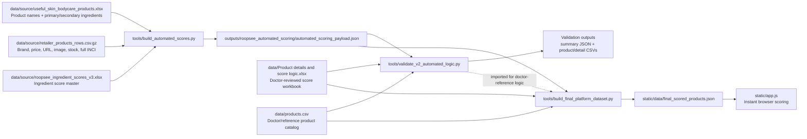
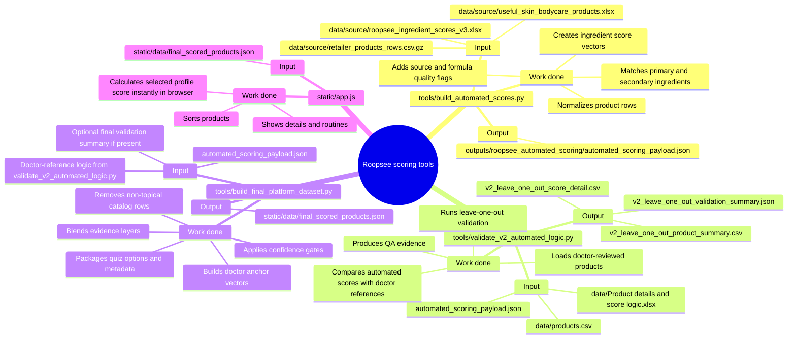

# Tools Pipeline Mind Map

This document explains how the three files inside `tools/` connect to each other, what each file takes as input, and what each file produces as output.

## Simple Flow



## Mind Map



## File 1: `tools/build_automated_scores.py`

This is the first generation step. It converts source sheets into the intermediate automated scoring payload.

### Inputs

| Input | Default path | Meaning |
| --- | --- | --- |
| Useful products sheet | `data/source/useful_skin_bodycare_products.xlsx` | Product list plus primary and secondary ingredients. |
| Retailer product export | `data/source/retailer_products_rows.csv.gz` | Catalog metadata such as brand, price, product URL, image URL, stock, and full ingredients when available. |
| Ingredient score master | `data/source/roopsee_ingredient_scores_v3.xlsx` | Ingredient suitability scores across skin concerns, skin types, age, and special conditions. |

### Output

```text
outputs/roopsee_automated_scoring/automated_scoring_payload.json
```

This output contains normalized products, matched ingredients, score columns, ingredient-match status, formula-quality flags, and metrics.

## File 2: `tools/validate_v2_automated_logic.py`

This is the audit and calibration-check step. It checks whether the automated scoring behavior is close to the doctor-reviewed reference behavior.

### Inputs

| Input | Default path | Meaning |
| --- | --- | --- |
| Automated payload | `outputs/roopsee_automated_scoring/automated_scoring_payload.json` | Intermediate scores produced by `build_automated_scores.py`. |
| Doctor score workbook | `data/Product details and score logic.xlsx` | Doctor-reviewed product scores and logic. |
| Product reference CSV | `data/products.csv` | Reference product catalog used by the doctor-score engine. |

### Outputs

```text
outputs/roopsee_automated_scoring/v2_leave_one_out_validation_summary.json
outputs/roopsee_automated_scoring/v2_leave_one_out_product_summary.csv
outputs/roopsee_automated_scoring/v2_leave_one_out_score_detail.csv
```

These files are QA evidence. They are useful for review, but the final frontend does not need to load them directly.

## File 3: `tools/build_final_platform_dataset.py`

This is the final packaging step. It creates the fast JSON dataset used by the browser UI.

### Inputs

| Input | Default path | Meaning |
| --- | --- | --- |
| Automated payload | `outputs/roopsee_automated_scoring/automated_scoring_payload.json` | Product-level automated scores and ingredient evidence. |
| Doctor-reference logic | imported from `tools/validate_v2_automated_logic.py` | Reuses doctor-reference records and score-pair logic for anchoring. |
| Doctor workbook | `data/Product details and score logic.xlsx` | Used through the doctor-reference loader. |
| Product reference CSV | `data/products.csv` | Used through the doctor-reference loader. |
| Optional final validation summary | `outputs/roopsee_automated_scoring/final_rank_fusion_algorithm_validation_summary.json` | Included in metadata only if present. |

### Output

```text
static/data/final_scored_products.json
```

This is the main file the frontend uses. It includes products, score layers, confidence, nearest doctor anchors, quiz options, metadata, source-file paths, and the final high-confidence topical product set.

## How The Frontend Uses The Output

The frontend file `static/app.js` fetches:

```text
static/data/final_scored_products.json
```

Then it calculates the profile-wise score instantly in the browser when the user changes skin type, sensitivity, age, concern, gender, or special condition.

## Run Order

Use this order when rebuilding everything:

```bash
python3 tools/build_automated_scores.py
python3 tools/validate_v2_automated_logic.py
python3 tools/build_final_platform_dataset.py
```

If only the frontend needs the latest final JSON and the automated payload is already current, rerun only:

```bash
python3 tools/build_final_platform_dataset.py
```

## Environment Overrides

These optional environment variables let you test newer sheets without changing code:

| Variable | What it changes |
| --- | --- |
| `ROOPSEE_USEFUL_PRODUCTS` | Useful product ingredient sheet path. |
| `ROOPSEE_RETAILER_PRODUCTS` | Retailer product export path. |
| `ROOPSEE_INGREDIENT_SCORES` | Ingredient score master path. |
| `ROOPSEE_AUTO_OUTPUT_DIR` | Folder for intermediate automated scoring outputs. |
| `ROOPSEE_AUTO_PAYLOAD` | Exact automated payload path used by the final builder. |
| `ROOPSEE_FINAL_DATASET` | Exact final frontend JSON output path. |
